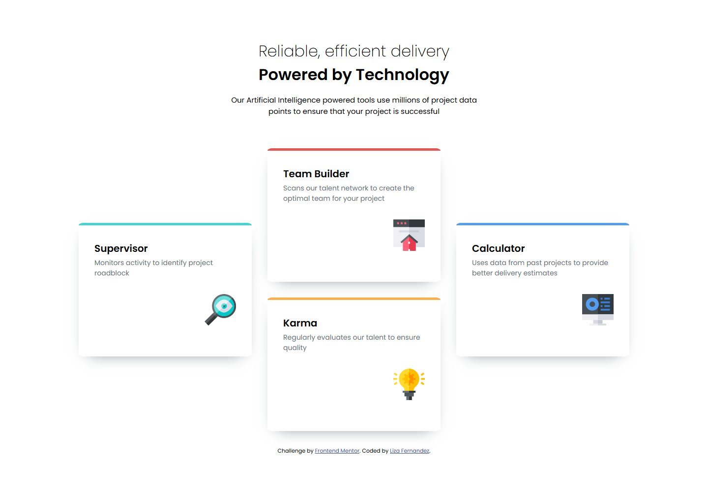
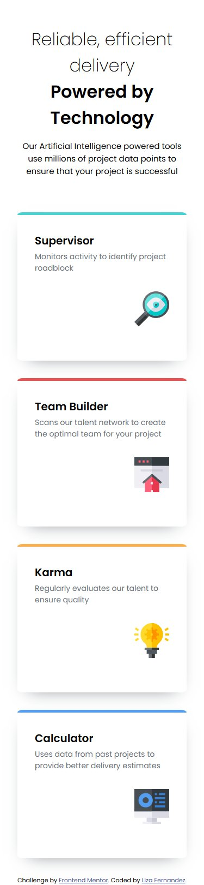

# Frontend Mentor - Four card feature section solution

This is a solution to the [Four card feature section challenge on Frontend Mentor](https://www.frontendmentor.io/challenges/four-card-feature-section-weK1eFYK). Frontend Mentor challenges help you improve your coding skills by building realistic projects.

## Table of contents

- [Overview](#overview)
  - [The challenge](#the-challenge)
  - [Screenshot](#screenshot)
  - [Links](#links)
- [My process](#my-process)
  - [Built with](#built-with)
  - [What I learned](#what-i-learned)
  - [Continued development](#continued-development)
  - [Useful resources](#useful-resources)
- [Author](#author)

## Overview

### The challenge

Users should be able to:

- View the optimal layout for the site depending on their device's screen size

### Screenshot

**Desktop View**


**Mobile View**


### Links

- Solution URL: [Add solution URL here](https://your-solution-url.com)
- Live Site URL: [https://four-card-feature-section-solution-lf.netlify.app](https://four-card-feature-section-solution-lf.netlify.app)

## My process

### Built with

- Semantic HTML5 markup
- CSS custom properties
- Flexbox
- CSS Grid
- Mobile-first workflow
- SASS

### What I learned

Working on this solution helped me learn how to use position items in specific rows and columns. I was also able to learn how to make a more elliptical border, by adding an additional radius as seen below.

```scss
@mixin cardBorder($border-color) {
  border-top: 5px solid $border-color;
  border-radius: 10px / 5px;
}
```

Overall, my major learning outcomes was being able to improve my skills in using CSS grids and SASS.

### Continued development

In the future, I would like to continue improving my skills and knowledge in using CSS grids, SASS and working in a mobile-first workflow.

### Useful resources

- [StackOverflow](https://stackoverflow.com/questions/5214893/right-align-an-image-using-css-html) - This helped me be able to align the icon images for the card components to the right.
- [MDN Web Docs](https://developer.mozilla.org/en-US/docs/Web/CSS/border-radius) - This documentation for the border-radius property, helped me to be able to create a more elliptical border for the top border of the card components.
- [CSS Tricks Grid Layout Guide](https://css-tricks.com/snippets/css/complete-guide-grid/) - This guide was extremely helpful in learning how to position the card components in specific rows and columns in the grid.

## Author

- Website - [lizafernandez.dev](https://lizafernandez.dev)
- Frontend Mentor - [@aelvanna](https://www.frontendmentor.io/profile/aelvanna)
